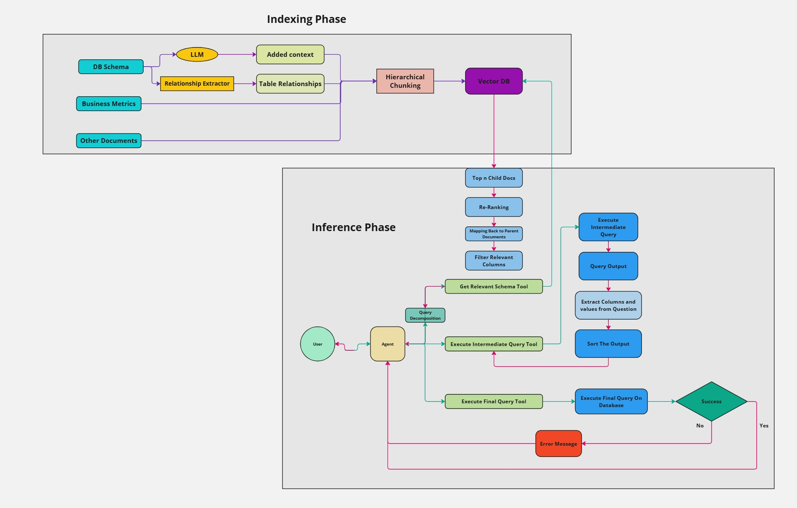

## **Project Overview**
**SQL Copilot** is an AI-powered assistant designed to help users interact with their SQL databases through a conversational chat interface. Users can configure their SQL database, and the AI assistant will assist with all aspects of querying and data analysis, from basic queries to complex operations. SQL queries are executed directly on the user's database, providing a flexible and interactive experience for data exploration.

### **Architecture**
------------------------

------------------------
### **Key Features**
- **Easy Database Configuration**: Users can configure and connect their SQL databases (e.g., MySQL, PostgreSQL, SQL Server, etc.) to begin querying.
- **Conversational Interaction**: Through chat-based conversation, users can ask the assistant to execute SQL queries, perform joins, aggregations, and more.
- **Data Exploration**: Inspect the database schema, retrieve records, filter data, and execute various SQL operations.
- **Query Optimization**: The assistant can help optimize queries for performance and handle complex SQL logic like joins and subqueries.
- **Real-Time Feedback**: SQL query results are displayed in real-time within the chat interface, providing immediate feedback on data exploration.
- **Customizable Query Execution**: Users can access and modify the SQL queries during the process, allowing for full control and customization.

### **How It Works**
1. **Configure Your Database**: Start by providing the connection details for your SQL database (host, port, database name, username, password).
2. **Conversational Interface**: Interact with the AI assistant through natural language commands. You can ask it to run specific queries, perform joins, or filter data.
3. **Query Execution**: The AI assistant generates and runs SQL queries on your database, allowing you to adjust or modify them as needed.
4. **Receive Real-Time Results**: View the SQL query results directly in the chat in real-time.
5. **Access and Modify Queries**: Get access to the underlying SQL queries, enabling you to tweak or optimize them for better performance or accuracy.

### **How to Run the Project**

```bash
git clone https://github.com/VishnuDurairaj/Robust-SQL-Copilot.git
cd Robust-SQL-Copilot
```

### **1.Clone the Repository:**

```bash
git clone https://github.com/VishnuDurairaj/Robust-SQL-Copilot.git
cd Robust-SQL-Copilot
```

### **2.Run the Services with Docker Compose:**
```bash
docker-compose up
```

Access the Interface: Open your browser and go to http://localhost:8080 to start interacting with the SQL Copilot.

Configure Your Database: Provide your SQL database connection details through the interface, and start a conversation with the AI assistant to query and analyze your database.